# Mermaid to React Flow Converter

## Table of Contents
- [Overview](#overview)
- [Features](#features)
- [Architecture](#architecture)
- [Folder Structure](#folder-structure)
- [Usage](#usage)
- [Development](#development)
- [Internals](#internals)
- [Technologies](#technologies)
- [Examples](#examples)
- [Contribution](#contribution)
- [License](#license)

---

## Overview

**Mermaid to React Flow Converter** is a powerful web application that transforms Mermaid diagrams from markdown files into interactive, editable React Flow visualizations. It supports advanced editing, exporting, and management of diagrams, making it ideal for technical documentation, flowchart creation, and collaborative design.

---

## Features

- **Markdown Parsing**: Extracts Mermaid code blocks from markdown files or pasted content.
- **Mermaid to React Flow Conversion**: Converts Mermaid flowcharts into React Flow nodes and edges, preserving structure and relationships.
- **Interactive UI**: Pan, zoom, minimap, live preview, and code preview.
- **Diagram Management**: Save, update, delete, and organize diagrams with metadata and tags.
- **Editing Tools**: Align, distribute, group/ungroup, bring to front/back, duplicate, delete, lock/unlock nodes, and more.
 - **Editing Tools**: Align, distribute, group/ungroup, bring to front/back, duplicate, delete, lock/unlock nodes, and more.
     - ⚠️ Alignment is not perfect: You may need to manually move nodes to achieve the desired layout after auto-aligning.
- **Export**: Export diagrams as PNG images with custom bounding box and pixel ratio.
- **Subgraph & Nested Support**: Handles Mermaid subgraphs and nested structures, visualizing them as grouped nodes.
- **Multiple Diagrams**: Supports multiple diagrams per markdown file, with selection and preview.
- **Custom Node Types**: Image nodes, subgraph nodes, and custom rendering.
 - **Custom Node Types**: Image nodes, subgraph nodes, and custom rendering.
     - 🖼️ You can edit nodes to add images (e.g., logos, icons) directly in the diagram.
     - 🚧 Exporting diagrams with image links is not yet supported—images will not appear in exported PNGs if they use external links.
- **Real-Time Conversion**: Instant updates as you edit markdown or diagram.
- **Responsive Design**: Works on desktop and mobile browsers.

---

## Architecture

The application is built with a modular, scalable architecture:


- **App.tsx**: Main entry, manages state, markdown input, diagram selection, and UI layout.
- **FlowDiagram**: Renders React Flow diagram, handles node/edge state, editing, and toolbar actions.
- **MermaidRenderer**: Renders Mermaid SVG for preview, supports pan/zoom.
- **diagramStorage**: LocalStorage-based diagram CRUD, metadata, and persistence.
- **mermaidParser**: Extracts Mermaid diagrams from markdown, detects type and heading.
- **mermaidToReactFlow**: Converts Mermaid AST to React Flow nodes/edges, handles layout, subgraphs, and edge types.
- **EditingToolbar**: Advanced editing actions for selected nodes/edges.
- **exportImage**: Exports diagram as PNG using html-to-image.
- **CustomNode/SubgraphNode/NodeEditor**: Custom React Flow node types and editors.

---

## Folder Structure

```mermaid
flowchart TD
    %% =========== Root Level ===========
    subgraph Root["📁 Project Root"]
        direction TB
        F[📄 README.md]
        D[index.html]
        A[public/]
        B[src/]
    end

    %% =========== public/ folder ===========
    subgraph A["public/"]
        direction TB
        A2[favicon.ico]
        A1[assets/]
    end

    %% =========== src/ folder ===========
    subgraph B["src/"]
        direction TB
        B4[main.tsx]
        B1[App.tsx]
        B6[components/] 
        B8[utils/] 
        B3[index.css]
        B2[App.css]
    end

    %% =========== Components ===========
    subgraph B6["components/"]
        direction LR
        C1[FlowDiagram.tsx]
        C2[MermaidRenderer.tsx]
        C3[NodeEditor.tsx]
        C4[EditingToolbar.tsx]
    end

    %% =========== Utils ===========
    subgraph B8["utils/"]
        direction LR
        U1[mermaidToReactFlow.ts]
        U2[mermaidParser.ts]
        U3[diagramStorage.ts]
        U4[exportImage.ts]
    end

    %% =========== Annotations ===========
    B4 -->|"«entry»<br>Entry Point"| Note1[ ]
    B1 -->|"«root»<br>Main Component"| Note2[ ]

    style Note1 fill:#fff5e6,stroke:#ff9800,stroke-dasharray:4 2,opacity:0.8
    style Note2 fill:#fff5e6,stroke:#4caf50,stroke-dasharray:4 2,opacity:0.8

    classDef folder fill:#eef5ff,stroke:#3366cc,stroke-width:1.5px,rx:6px,ry:6px
    classDef utility fill:#fef5e7,stroke:#d98b00,rx:4px
    classDef component fill:#f0f8e8,stroke:#2e8b57,rx:4px
    classDef file fill:#ffffff,stroke:#999,stroke-width:1px,rx:2px

    class A,B,A1,A2,B6,B8 folder
    class U1,U2,U3,U4 utility
    class C1,C2,C3,C4 component
    class F,P,E,N,D,B1,B2,B3,B4 file
```



---

## Usage

### Quick Start
1. Install dependencies: `npm install`
2. Start development server: `npm run dev`
3. Open browser at the provided local URL
4. Upload a markdown file or paste Mermaid content
5. Select and interact with diagrams

### Advanced Usage
- **Edit diagrams**: Use the toolbar for alignment, grouping, and more
 - **Edit diagrams**: Use the toolbar for alignment, grouping, and more (note: alignment may require manual adjustment)
- **Export**: Click export to save as PNG
 - **Export**: Click export to save as PNG (images from external links are not included yet)
- **Save/Load**: Diagrams are persisted in browser localStorage
- **Preview**: Toggle code and live preview

---

## Development

### Scripts
- `npm run dev`: Start development server
- `npm run build`: Build for production
- `npm run preview`: Preview production build

### Configuration
- **Vite**: Fast build and dev server
- **TypeScript**: Strict typing and modern JS features

---

## Internals

### Key Data Models
- **MermaidDiagram**: `{ type, code, name, position }`
- **ReactFlowData**: `{ nodes: Node[], edges: Edge[] }`
- **SavedDiagram**: `{ id, name, nodes, edges, originalMermaidCode, createdAt, updatedAt, metadata }`

### Main Functions
- `extractMermaidDiagrams(markdown)`: Finds all Mermaid blocks and headings
- `convertMermaidToReactFlow(code)`: Converts Mermaid AST to React Flow
- `saveDiagram(diagram)`: Persists diagram to localStorage
- `exportReactFlowImage({ wrapper, nodes, ... })`: Exports diagram as PNG

### Editing Actions
- `alignNodes`, `distributeNodes`, `groupNodes`, `bringToFront`, `duplicateNodes`, `deleteSelected`, `lockNodes`, `unlockNodes`

---

## Technologies

- **React**: UI framework
- **React Flow**: Diagram rendering and interaction
- **Mermaid**: Diagram parsing and SVG rendering
- **TypeScript**: Type safety
- **Vite**: Build tool
- **Bootstrap**: UI styling
- **Dagre**: Graph layout
- **html-to-image**: Export diagrams as images

---

## Examples

### Example Markdown
```markdown
# Example Flowchart

```

### Example Output


---

## Contribution
---

## Credits & License

This project started from [james-prysm/mermaid-to-reactflow](https://github.com/james-prysm/mermaid-to-reactflow) — thanks to James for the starter! Many additional features and improvements have been added since then.

This project is licensed under the MIT License (c) 2025.